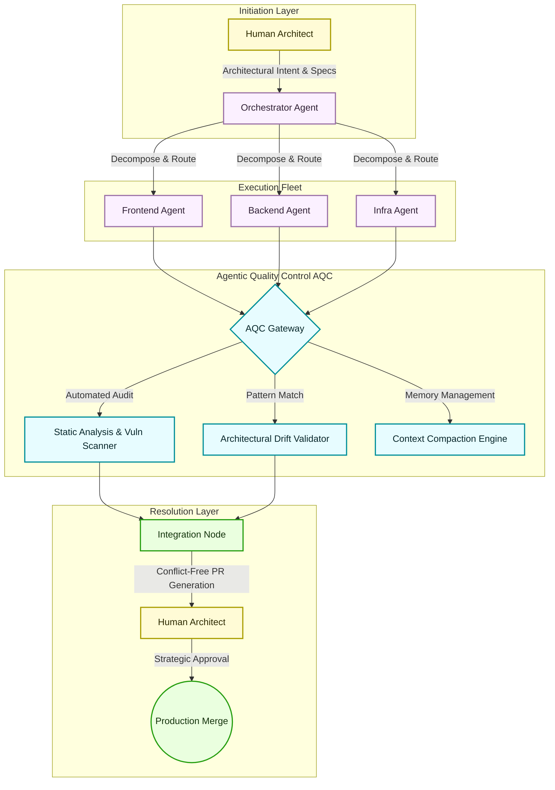

# Markdown Examples

## h2 Heading

### h3 Heading

#### h4 Heading

##### h5 Heading

###### h6 Heading

## Emphasis

**This is bold text**

_This is italic text_

~~Strikethrough~~

==Highlight==

## Blockquotes

> Develop. Preview. Ship. – Vercel

## Lists

Unordered

- Lorem ipsum dolor sit amet
- Consectetur adipiscing elit
- Integer molestie lorem at massa

Ordered

1. Lorem ipsum dolor sit amet
2. Consectetur adipiscing elit
3. Integer molestie lorem at massa

## Code

Inline `code`

```js
export default function Nextra({ Component, pageProps }) {
  return (
    <>
      <Head>
        <link
          rel="alternate"
          type="application/rss+xml"
          title="RSS"
          href="/feed.xml"
        />
        <link
          rel="preload"
          href="/fonts/Inter-roman.latin.var.woff2"
          as="font"
          type="font/woff2"
          crossOrigin="anonymous"
        />
      </Head>
      <Component {...pageProps} />
    </>
  )
}
```



## Tables

| **Option** | **Description**                                                                                                             |
| ---------- | --------------------------------------------------------------------------------------------------------------------------- |
| First      | Lorem ipsum dolor sit amet, consectetur adipiscing elit, sed do eiusmod tempor incididunt ut labore et dolore magna aliqua. |
| Second     | Lorem ipsum dolor sit amet, consectetur adipiscing elit, sed do eiusmod tempor incididunt ut labore et dolore magna aliqua. |
| Third      | Lorem ipsum dolor sit amet, consectetur adipiscing elit, sed do eiusmod tempor incididunt ut labore et dolore magna aliqua. |

## Links

- [Next.js](https://nextjs.org)
- [Nextra](https://nextra.vercel.app/)
- [Vercel](http://vercel.com)

### Footnotes

- Footnote [^1].
- Footnote [^2].

[^1]: Footnote **can have markup**

and multiple paragraphs.

[^2]: Footnote text.
